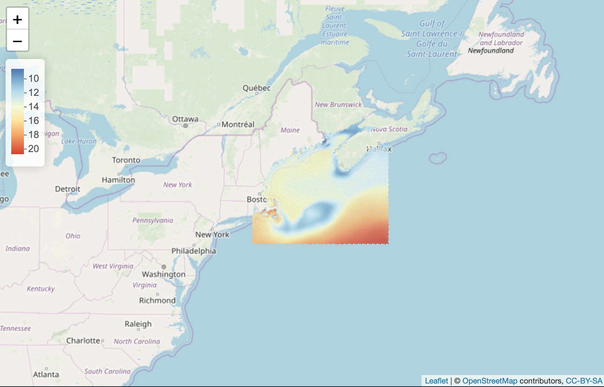
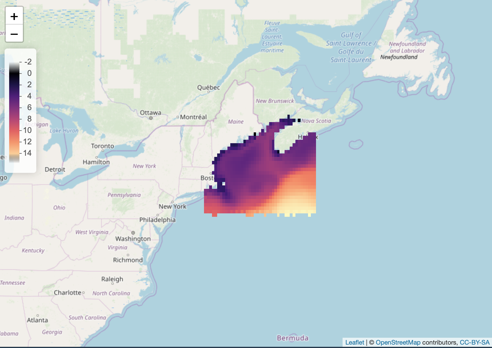

# GOM 2050 with ROMS output

### R packages

#### From CRAN (`install.packages(...)`)
+ [here](https://cran.r-project.org/package=here)
+ [sf](https://cran.r-project.org/package=sf)
+ [ncdf4](https://cran.r-project.org/package=ncdf4)
+ [dplyr](https://cran.r-project.org/package=dplyr)
+ [raster](https://cran.r-project.org/package=raster)
+ [leaflet](https://cran.r-project.org/package=leaflet)
+ [rasterVis](https://cran.r-project.org/package=rasterVis)
+ [RColorBrewer](https://cran.r-project.org/package=RColorBrewer)
+ [fasterize](https://cran.r-project.org/package=fasterize)

#### From Github (`devtools::install_github(...)`)
+ [rasf](https://github.com/BigelowLab/rasf)

### Organization

First start a fresh session of R, set the working directory with `setwd("/path/to/project/")`, and move RStudio's file browser that that directory using the menu `Files > More > Go to Working Directory`.


* `setup.R` a script to setup and source other functions

* `README.md`

* `data` data plus orginal download
    + `GOM_2050` source data
    + `orig` original download
    + ... other items
  
* `R` files with functions

* `scripts` files to manage workflows

### git and Github

Your [.gitignore](https://github.com/github/gitignore/blob/master/R.gitignore) should be set up to ignore `.nc` and `.tif` files.  Later other files and or directories may need to be excluded to keep the Github repo smallish.

Install this repo on *nix sing `git clone git@github.com:BigelowLab/gom_2050.git` or using the GitHub Desktop application.

### Basic Usage

From a new R session navigate to your GOM_2050 directory.  Then source the setup script.

```
setwd("/your/path/to/GOM_2050")
source("setup.R")
```

Open a ncdf file.  Retrieve spatial-aware data for the long term mean and one of the models as anomalies. Note that content summaries of each file has been dumped.  For example,
see the dump of [sst.ROMS.2050.GOM.anom.nc](data/ncdump/sst.ROMS.2050.GOM.anom.nc.txt)

```
NC <- open_nc("sst")

# the long term mean of sst
sst_ltm <- nc_get_var(NC, var = "ctrl", month = c('Jun', 'Jul', 'Aug'), form = 'sf')
# Simple feature collection with 22078 features and 3 fields
# geometry type:  POINT
# dimension:      XY
# bbox:           xmin: -77.27542 ymin: 35.71551 xmax: -59.47327 ymax: 48.44975
# epsg (SRID):    4326
# proj4string:    +proj=longlat +datum=WGS84 +no_defs
# # A tibble: 22,078 x 4
#                geometry   Jun   Jul   Aug
#             <POINT [°]> <dbl> <dbl> <dbl>
#  1 (-70.53504 35.71551)    NA    NA    NA
#  2 (-70.47295 35.75371)    NA    NA    NA
#  3 (-70.41081 35.79188)    NA    NA    NA
#  4  (-70.3486 35.83001)    NA    NA    NA
#  5 (-70.28634 35.86812)    NA    NA    NA
#  6 (-70.22401 35.90619)    NA    NA    NA
#  7 (-70.16163 35.94423)    NA    NA    NA
#  8 (-70.09919 35.98224)    NA    NA    NA
#  9 (-70.03669 36.02022)    NA    NA    NA
# 10 (-69.97413 36.05816)    NA    NA    NA
# # … with 22,068 more rows

# and the model anomalies in 2050 - these the same form as the long term mean
sst_gfdl <- nc_get_var(NC, var = "gfdl2050", month = c('Jun', 'Jul', 'Aug'), form = 'sf')
sst_ipsl <- nc_get_var(NC, var = "ipsl2050", month = c('Jun', 'Jul', 'Aug'), form = 'sf')
sst_hadgem <- nc_get_var(NC, var = "hadgem2050", month = c('Jun', 'Jul', 'Aug'), form = 'sf')

# a quick summary
summary(sst_hadgem)
#          geometry          Jun             Jul             Aug       
# POINT        :22078   Min.   :0.985   Min.   :0.637   Min.   :0.768  
# epsg:4326    :    0   1st Qu.:1.997   1st Qu.:1.889   1st Qu.:1.960  
# +proj=long...:    0   Median :2.356   Median :2.231   Median :2.254  
#                       Mean   :2.228   Mean   :2.183   Mean   :2.248  
#                       3rd Qu.:2.498   3rd Qu.:2.470   3rd Qu.:2.489  
#                       Max.   :3.386   Max.   :3.659   Max.   :3.642  
#                       NA's   :15668   NA's   :15668   NA's   :15668 

# or a quick and dirty map
leaflet_points(sst_ltm, varname = 'Jun')
```


We likely want to have the points rasterized which is a two step process.  First we create a mesh (delaunay triangulation) where each mesh element is the mean of the three nodes (points).  We then create the raster, passing the function a template that provides the raster size specifications.  All fo the details are hidden from the user.

```
sst_ltm_raster <- nc_get_var(NC, var = "ctrl", month = 'Jan', form = 'raster', template =  raster_template(sst_ltm, res = c(0.2, 0.2)))
# class      : RasterLayer 
# dimensions : 65, 90, 5850  (nrow, ncol, ncell)
# resolution : 0.2, 0.2  (x, y)
# extent     : -77.37542, -59.37542, 35.54975, 48.54975  (xmin, xmax, ymin, ymax)
# crs        : +proj=longlat +datum=WGS84 +no_defs 
# source     : memory
# names      : layer 
# values     : -0.08153454, 15.60542  (min, max)

leaflet_raster(sst_ltm_raster)
```



### Data source

```
From: James Scott - NOAA Affiliate <james.d.scott@noaa.gov>
Date: Wed, Jul 24, 2019 at 2:05 PM
Subject: ROMS 2050 anomalies
To: Andrew J. Pershing <apershing@gmri.org>, to: Brickman, David <David.Brickman@dfo-mpo.gc.ca>, Mike Alexander <michael.alexander@noaa.gov>, Joe Salisbury <joe.salisbury@unh.edu>, Dwight Gledhill <dwight.gledhill@noaa.gov>, Samantha Siedlecki <samantha.siedlecki@uconn.edu>


Hi, I've made the ROMS 2050 anomalies available on google drive.
https://drive.google.com/drive/folders/1WCSuBWxD0wLiFFVR6AHHQclujhI43PE4?usp=sharing

These netCDF files contain data from ROMS regional ocean model experiments subset for the Gulf of Maine region. Each contain 12 months starting in January, ending in December. Latitude (lat) and longitude (lon) in the model are two-dimensional in (y,x) named (eta_rho, xi_rho). The y,x are not oriented N/S/E/W, but are rotated to follow the NE US coast line.

Each file contains the climate from the control experiment (cntrl) which represents the 1976-2005 climate. Each file also has anomalies (scaled to 2050) where the climate change signal from 3 CMIP5 models was added to the CTRL forcing (gfdl2050, ipsl2050, hadgem2050). These are the downscaled projected changes (relative to 1976-2005) for the 2050 climate in the GOM.

There are 4 single level files:
sss.ROMS.2050.GOM.anom.nc      :Sea Surface Salinity (PSU)
sst.ROMS.2050.GOM.anom.nc      :Sea Surface Temperature (deg C)
botSalt.ROMS.2050.GOM.anom.nc  :Bottom (<300m depth) Salinity (PSU) 
botT.ROMS.2050.GOM.anom.nc     :Bottom (<300m depth) Temperature (deg C)

There are 5 multilevel files with 18 depths 
(10, 20, 30, 40, 50, 60, 70, 80, 90, 100, 125, 150, 175, 200, 225, 250, 275, 300 meters):
These files also contain the model bathymetry for GOM.

temp.depth.ROMS.2050.GOM.anom.nc       :Ocean Temp (deg C)
salinity.depth.ROMS.2050.GOM.anom.nc   :Ocean Salinity (PSU)
U.velocity.depth.ROMS.2050.GOM.anom.nc :Ocean Zonal Velocity (cm/s)
V.velocity.depth.ROMS.2050.GOM.anom.nc :Ocean Meridional Velocity (cm/s)
velocity.depth.ROMS.2050.GOM.anom.nc   :Ocean Velocity Magnitude (cm/s) 
                                       :Use velocity magnitude when interested in 
                                       :changes in total velocity instead of U,V 
                                       :components. Velocity is computed from 5 :day average U, V

One additional file is for dissolved inorganic carbon. It was not produced in the ROMS downscaled experiments since they did not have BGC processes.  This is from the Ensemble Mean CMIP5 BGC models on a 1 degree x 1 degree grid.

dic.CMIP5.ensmn.2050.GOM.anom.nc  :dissolved inorganic carbon and surface
                                  :(10^-2 mol m^-3)  
Contains the Jan-Dec historical climate (climhist) and 2050 anomalies (anom2050) and lat and lon.

You can check your results with the files in the Images directory to see if you are reading the data correctly.
```
